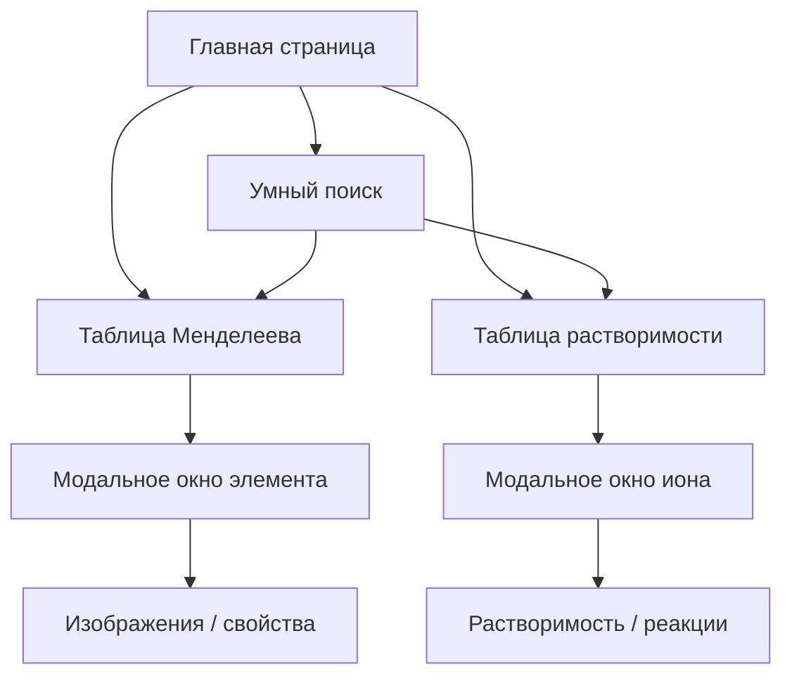

# ⚛️ Mendeleev Lab  
### Интерактивная таблица Менделеева и таблица растворимости

🔬 Современный проект для изучения химии с анимациями, модальными окнами и умным поиском.

---

---

🛡️ **Лицензия проекта:**  
Проект распространяется по лицензии **Mendeleev Lab License v1.0 (MLL-1.0)**.  
Использование и копирование материалов разрешено **только с письменного разрешения автора**.  
Подробнее — см. [лицензию](https://github.com/DIBERLOG/mendeleev-lab/blob/main/LICENSE.md).

---

## 🚀 Основные возможности

✅ **Интерактивная таблица Менделеева**  
Подробные модальные окна с изображениями, вкладками и химическими свойствами для каждого элемента.

✅ **Таблица растворимости веществ**  
Визуальное представление катионов и анионов, их характеристик, реакций и исключений.

✅ **Умный поиск по всем данным**  
Ищет сразу по элементам, ионам, формулам и реакциям. Подсвечивает найденные совпадения в реальном времени.

✅ **Адаптивный интерфейс**  
Оптимизация под мобильные устройства и планшеты. Изображения и карточки автоматически перестраиваются.

✅ **Форма обратной связи**  
Работает через Formspree. Сообщения приходят напрямую автору без необходимости сервера.

✅ **Использование защищённого протокола HTTPS**  
Весь сайт доступен только через HTTPS — данные формы и запросы пользователей шифруются,  
а подключение подтверждено сертификатом Let’s Encrypt.

✅ **Безопасное хранение данных**  
Все пользовательские данные (сообщения, поисковые запросы) не сохраняются, обеспечивая приватность.

---
## 🧱 Технологический стек

| Раздел | Технологии |
|--------|-------------|
| 🖥️ Frontend | HTML5, CSS3, JavaScript (ES6+) |
| ⚙️ Визуализация | Swiper.js, кастомные модальные окна |
| 🎨 UI/UX | Адаптивный дизайн, анимации, шрифты |
| 🌐 Хостинг | GitHub Pages + Selectel DNS |
| 🔒 Безопасность | HTTPS (Let’s Encrypt), CORS-защита |
| 📤 Обратная связь | Formspree API |

---

## 📊 Диаграмма структуры проекта

---

    
🛡️  **Лицензия проекта:**  
Этот проект распространяется по специальной лицензии **MendeleevLab Personal License (MLPL)**.  
Копирование, распространение и использование материалов разрешено **только с разрешения автора**.  
Подробнее см. раздел 

